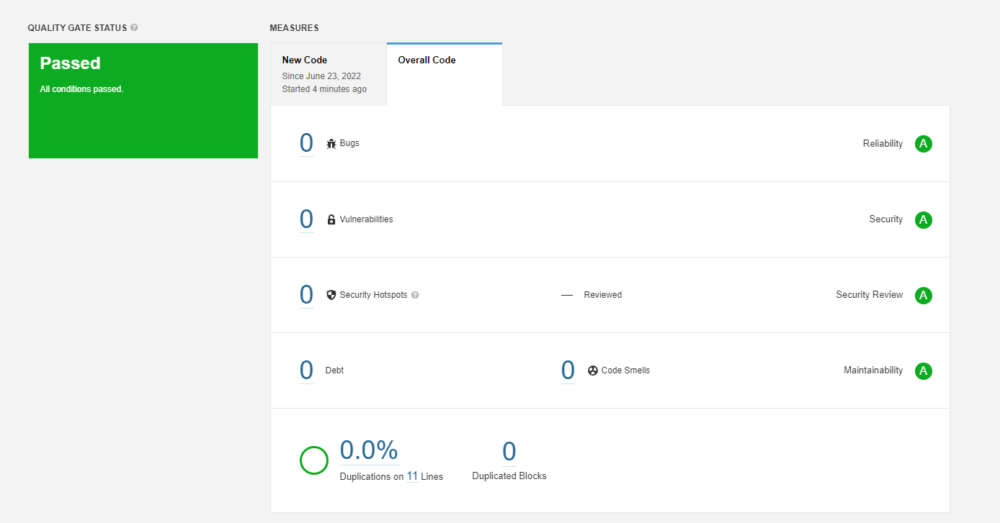

# Домашнее задание к занятию "09.02 CI\CD" Соловьев Д.В.

## Знакомство с SonarQube

### Основная часть

>1. Создаём новый проект, название произвольное
>2. Скачиваем пакет sonar-scanner, который нам предлагает скачать сам sonarqube
>3. Делаем так, чтобы binary был доступен через вызов в shell (или меняем переменную PATH или любой другой удобный вам способ)
>4. Проверяем `sonar-scanner --version`
>5. Запускаем анализатор против кода из директории [example](./example) с дополнительным ключом `-Dsonar.coverage.exclusions=fail.py`
>6. Смотрим результат в интерфейсе
>7. Исправляем ошибки, которые он выявил(включая warnings)
>8. Запускаем анализатор повторно - проверяем, что QG пройдены успешно
>9. Делаем скриншот успешного прохождения анализа, прикладываем к решению ДЗ

## Знакомство с Nexus

### Основная часть

>1. В репозиторий `maven-public` загружаем артефакт с GAV параметрами:
>    1. groupId: netology
>    2. artifactId: java
>    3. version: 8_282
>    4. classifier: distrib
>    5. type: tar.gz
>2. В него же загружаем такой же артефакт, но с version: 8_102
>3. Проверяем, что все файлы загрузились успешно
>4. В ответе присылаем файл `maven-metadata.xml` для этого артефекта

Файл [maven-metadata.xml](./src/maven-metadata.xml)

## Знакомство с Maven

### Основная часть

>1. Меняем в `pom.xml` блок с зависимостями под наш артефакт из первого пункта задания для Nexus (java с версией 8_282)
>2. Запускаем команду `mvn package` в директории с `pom.xml`, ожидаем успешного окончания
>3. Проверяем директорию `~/.m2/repository/`, находим наш артефакт
>4. В ответе присылаем исправленный файл `pom.xml`

Исправленный файл [pom.xml](./mvn/pom.xml)

---
